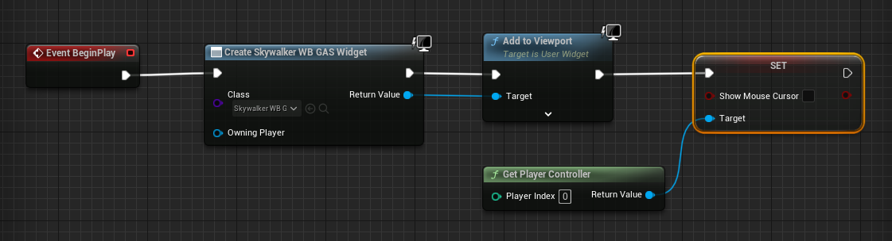
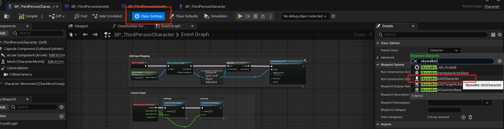

# SkywalkerGameplayAbilitySystem

## 目录说明

### AbilitySystemComponent

### AttributeSet

### Character

### GameplayAbility

### GameplayActor

### GameplayCue

### GameplayEffect

### Include

### Skill

### SkillAttribute

### TargetActor

## 使用说明

找到 `GameMode`蓝图增加UI

修改生物继承类

